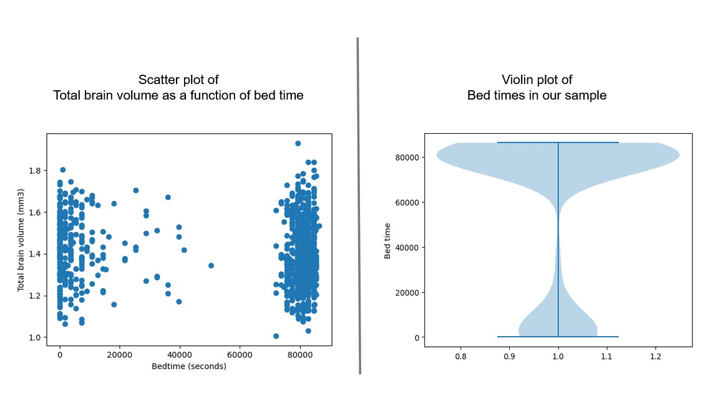

# YAHDA
YAHDA is an acronym that stands for **Young Adult Health Data Analysis**. The datasets used in this project come from the [HCP - Young Adult data](https://www.humanconnectome.org/study/hcp-young-adult) about the human brain.

## What is YAHDA?
The Human Connectome Project (HCP) provides the scientific community with data and discoveries that greatly enhance our understanding of human brain structure, function, and connectivity and their relationships to behavior.  

YAHDA is a data analysis project using raw data from HPC to show the effects of bedtime (sleep duration) on brain volume.

## Preview of the data - Bedtime and Brain volume
See the correlation between bedtime and brain volume in the sample.
  

## Preview of the data - Brain volume and Brain structure
See the distribution of brain volume and structure among the subjects.
 

## What can you find in this repo?
Here is a description of the content of this repository.

#### Data Analysis Notebooks
This repository contains Notebooks with a step-by-step process to load, transform, and visualize data in CSV and PNG format.
 
#### Datasets
This repository contains two main datasets in CSV and PNG formats.

## Where to go from here?
Learn more about the brain through data visualization or any other method.
